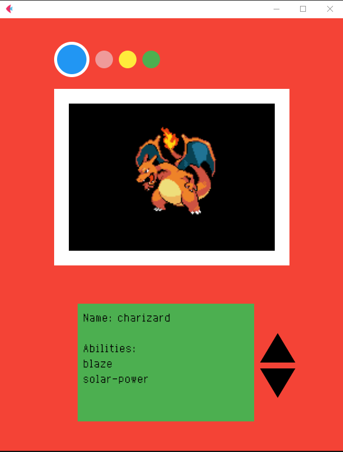

# Pokédex

A simple pokédex built with Python and Flutter.

## Requirements

- [Python](https://www.python.org/)

## Getting Started

1. Clone the Repository

```bash
git clone https://github.com/ZairBulos/pokedex.git
```

2. Go to the project directory

3. Create a virtual environment

```bash
python -m venv venv
./venv/Scripts/activate  # Windows
source venv/bin/activate  # macOS/Linux
```

4. Install the dependencies

```bash
pip install -r requirements.txt
```

## Usege

To run the application, execute the following command:

```bash
flet .\main.py
```

## Screenshot

<p align="center">
    
</p>